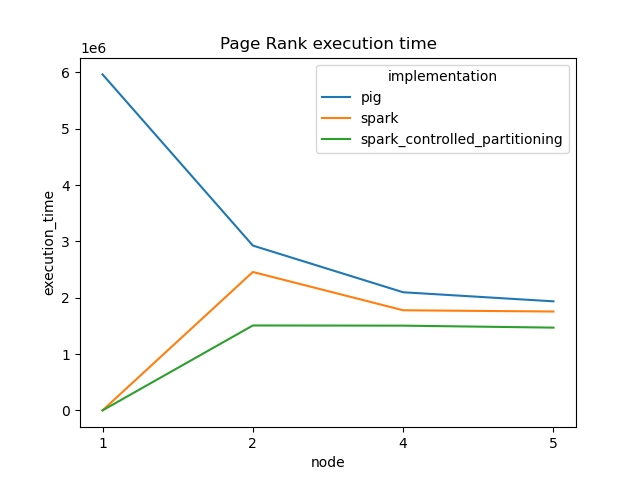
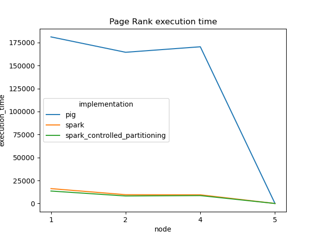

# LARGE SCALE DATA MANAGEMENT

## GROUP MEMBERS

- Yotlan LE CROM (<https://github.com/Yotlan>)
- Endy YU (<https://github.com/endyappel>)
- Florian MONSION (<https://github.com/JayCramboui>)

## PAGES RANK : PIG VS SPARK VS SPARK + CONTROLLED PARTITIONNING

With gs://public_lddm_data/page_links_en.nt.bz2 :

| Page Rank implementation  | Number of nodes  | Execution time (ms)  |
|---------------------------|------------------|----------------------|
| Pig                       | 1                | 5 965 137            |
| Pig                       | 2                | 2 926 194            |
| Pig                       | 4                | 2 097 353            |
| Pig                       | 5                | 1 936 174            |
| Spark                     | 1                | FAILED               |
| Spark                     | 2                | 2 457 349            |
| Spark                     | 4                | 1 755 194            |
| Spark                     | 5                | 1 777 790            |
| Spark + Controlled Part.  | 1                | FAILED               |
| Spark + Controlled Part.  | 2                | 1 507 807            |
| Spark + Controlled Part.  | 4                | 1 504 586            |
| Spark + Controlled Part.  | 5                | 1 469 502            |

The plot for this amount of data is bellow :



To know which entity have the best pagerank score, you need to enter this command bellow :

```py
python3 scripts/dataproc_maxentity_pagerank.py results/page_links_en.nt.bz2.out
```

This command return `Entity '<http://dbpedia.org/resource/Attention-deficit_hyperactivity_disorder>' have the best pagerank with 0.30051150556157313`

With gs://public_lddm_data/small_page_links.nt :

| Page Rank implementation  | Number of nodes  | Execution time (ms)  |
|---------------------------|------------------|----------------------|
| Pig                       | 1                | 181 134              |
| Pig                       | 2                | 164 404              |
| Pig                       | 4                | 170 397              |
| Pig                       | 5                | 179 346              |
| Spark                     | 1                | 16 176               |
| Spark                     | 2                | 9 570                |
| Spark                     | 4                | 9 431                |
| Spark                     | 5                | 9 503                |
| Spark + Controlled Part.  | 1                | 13 535               |
| Spark + Controlled Part.  | 2                | 8 173                |
| Spark + Controlled Part.  | 4                | 8 591                |
| Spark + Controlled Part.  | 5                | 7 810                |

The plot for this amount of data is bellow :



To know which entity have the best pagerank score, you need to enter this command bellow :

```py
python3 scripts/dataproc_maxentity_pagerank.py results/small_page_links.nt.out
```

This command return `Entity '<http://dbpedia.org/resource/Attention-deficit_hyperactivity_disorder>' have the best pagerank with 0.30051150556157313`

### PLOTTING RESULTS

To get theses plot, you need to enter this command bellow :

```py
python3 scripts/dataproc_plot.py results/pagesrank.json img/
```